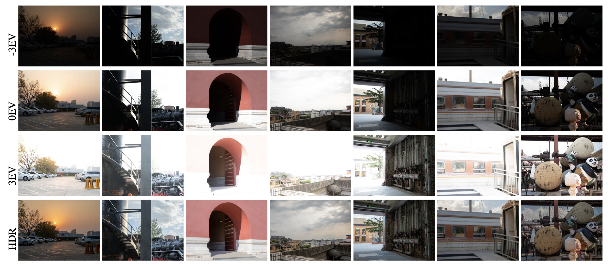
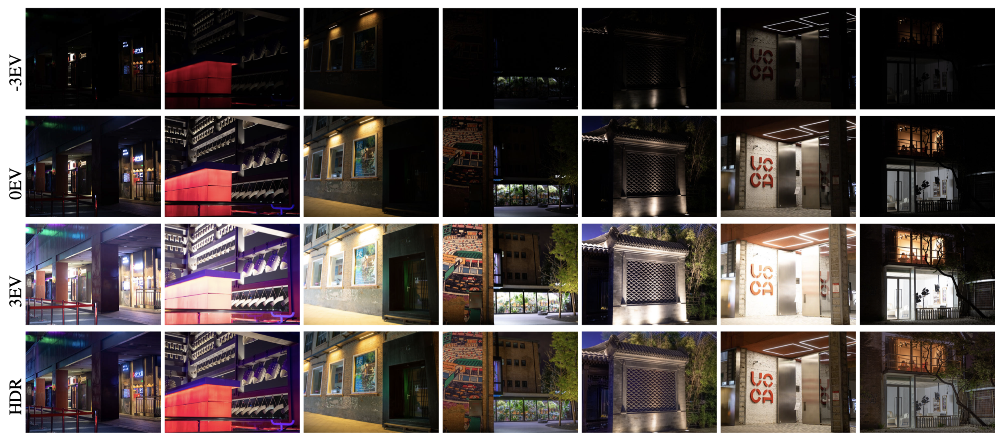

# RawHDR: High Dynamic Range Image Reconstruction from a Single Raw Image

​This is the dataset and code for [**RawHDR: High Dynamic Range Image Reconstruction from a Single Raw Image**](https://arxiv.org/abs/2309.02020), ICCV 2023, by Yunhao Zou, Chenggang Yan, and Ying Fu.

------
## News
* 2023/08/17: Release the Raw-to-HDR dataset
---
## Dataset Description
We capture a real paired Raw-to-HDR dataset for HDR reconstruction from a single Raw image. The captured dataset covers a large range of HDR scenarios, including modern/ancient buildings, art districts, tourist attractions, street shops and restaurants, abandoned factories, city views and so on. Those images are captured at different times of the day, including daytime and nighttime, which further guarantees the diversity of the paired Raw-to-HDR dataset. 

------

## Capturing Process
* Carefully choose HDR scenes
* Fix the camera (Canon 5D Mark IV) on a tripod
* Use bracket exposure mode to capture different exposures of the same scene including -3EV, 0EV, and +3EV
* 0EV Raw images are served as input images, ground truth images are fused by HDR merging method (Debevec etal., 2008)


## Dataset Details
In total, we collect 324 pairs of Raw/HDR images using Canon 5D Mark IV camera. For each scene, images are with a high resolution of $4480\times 6720$, and the final dataset is carefully checked and filtered to exclude misaligned pairs. The input Raw images of our dataset are recorded in 14-bit Raw format, and the corresponding HDR images are 20-bit, with additional image profiles (white balance, color correction matrix) recorded in the file.

------

## Dataset Link
You can download both the training data and testing data of this dataset at [**[One Drive]**](https://1drv.ms/f/s!AuA3qjJbfh9FiGTQqmw9U4z-vlKw?e=L9bCLg)[**[Baidu Disk]**](https://pan.baidu.com/s/1HOxGhTEY9whGxbEEw1QAjw)(Extraction Code: 4fxm).

------

## Representitive Example Scenes
**Daytime part**



**Nighttime part**



## Citation
```
@inproceedings{zou2023rawhdr,
  title={RawHDR: High Dynamic Range Image Reconstruction from a Single Raw Image},
  author={Zou, Yunhao and Yan, Chenggang and Fu, Ying},
  booktitle={Proceedings of the IEEE/CVF International Conference on Computer Vision},
  year={2023}
}
```
## contact
If you have any problems, please feel free to contact me at zouyunhao@bit.edu.cn


